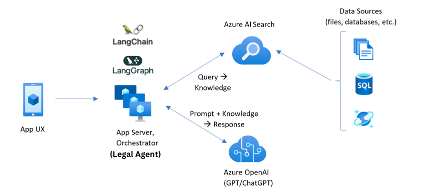
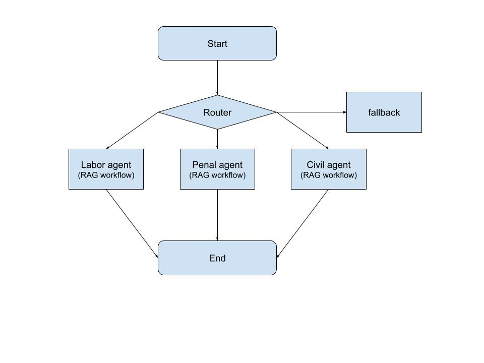
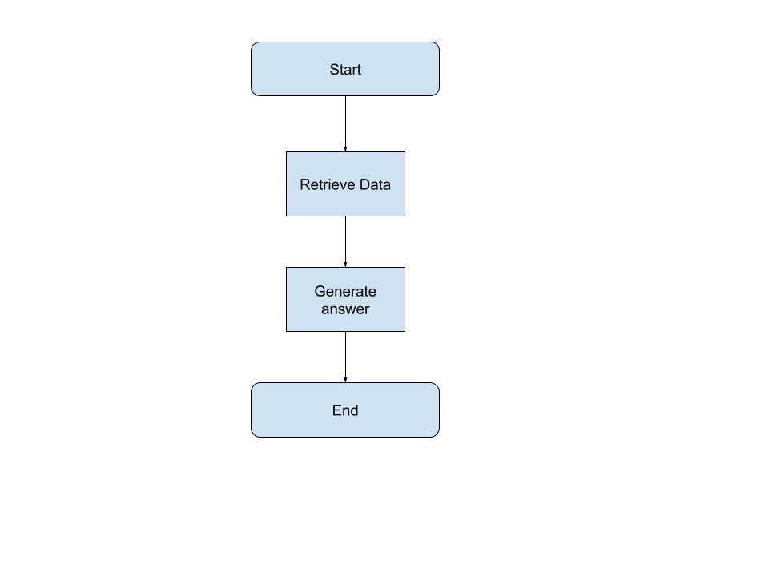
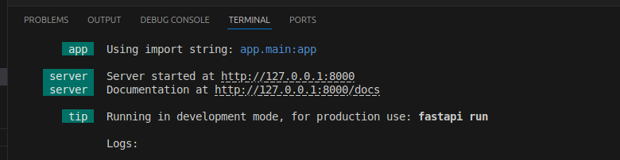
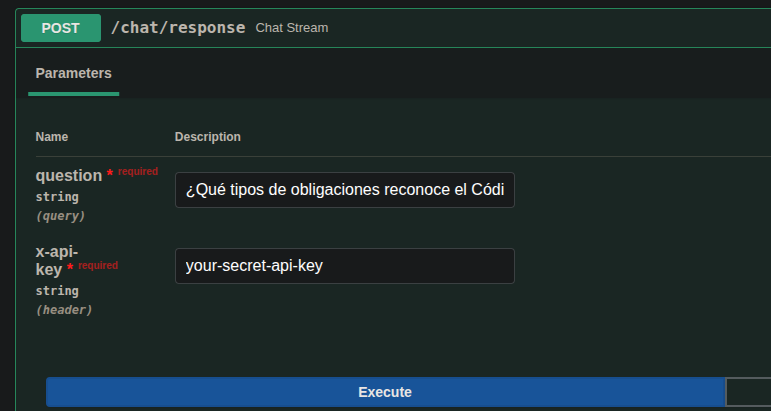
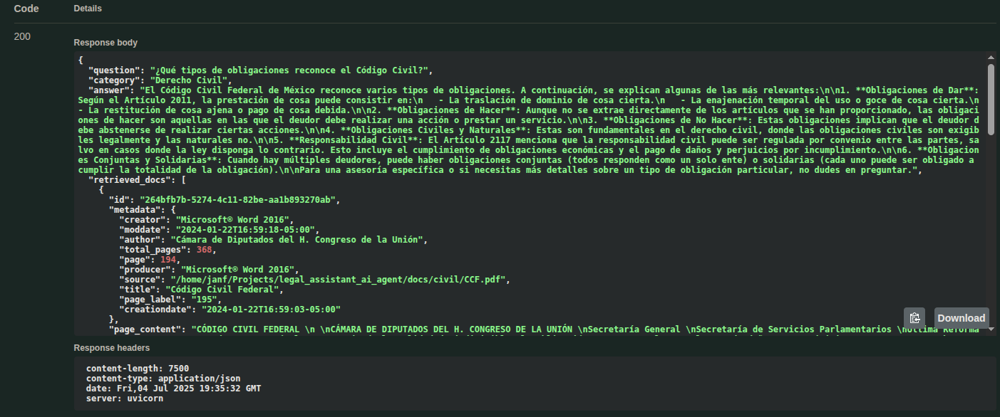

# 🧠 Legal Assistant AI Agent (Mexico Law · Internal Use)

This project implements an intelligent legal assistant for internal use in law firms, focused on **Mexican law**. It uses **LangChain**, **LangGraph**, **Chroma**, and multiple LLMs to deliver precise, document-based answers.

## 🔧 Key Features

* 🧭 **Category-based routing**: Questions are automatically classified (e.g., `Derecho Laboral`, `Derecho Civil`, etc.) and routed to specialized agents.
* 📄 **RAG (Retrieval-Augmented Generation)**: Each agent retrieves documents from category-specific vector stores (e.g., labor contracts, civil code).
* 🤖 **Multi-LLM fallback**: Supports fallback to alternate models (e.g., GPT-4o, Gemini, Anthropic) when a primary model fails.
* 🔁 **Fallback handling** when context is missing
* 🔐 **Document-grounded responses**: Answers are based strictly on indexed PDFs (Mexican laws, policies, contracts).
* ☁️ **Cloud-ready**: Designed to run on Azure (or locally), with modular components for easy scaling.


> Built with LangChain · LangGraph · Chroma · OpenAI · Google · Anthropic ·  Azure-ready

> Covers: Labor law, Civil law, and more.


## Design and Architecture

### Azure RAG Architecture with LangChain and LangGraph


### Legal Agent Workflow


### RAG Workflow


## Prototype Development

### Prototype Structure

```
legal_agent_rag/
├── app/
|   ├──main.py
|   ├──router.py
|   ├──llms.py
|   └──vector_store/
│   |   ├── ingest_docs.py         ← Load and create Chroma
│   |   └── retrievers.py           ← Retrieve context
|   └──agents/
│       ├── policy_agent.py        ← Use RAG
│       ├── contract_agent.py      ← Use RAG
│       └── compliance_agent.py    ← Use RAG
├── Docs/                      ← Intern PDF/DOCX
│   └── ...
└── index/                     ← Chroma index saved


```
### Installation (Linux Ubuntu)


```
$ git clone https://github.com/jorge-armando-navarro-flores/legal_assistant_ai_agent.git
```
```
$ cd legal_assistant_ai_agent
```
```
$ pip install -r requirements.txt
```
Ingest docs and create chroma local index
```
$ python3 app/vectorstore/ingest_docs.py 
```

### Environment Variables
.env
```
API_KEY=your-secret-api-key
GOOGLE_API_KEY=your-google-api-key
OPENAI_API_KEY=your-openai-api-key
ANTHROPIC_API_KEY=your-anthropic-api-key
LANGSMITH_TRACING=true
LANGSMITH_ENDPOINT=your-langsmith-endpoint
LANGSMITH_API_KEY=your-langsmith-api-key
LANGSMITH_PROJECT=your-langsmith-project-name
```

### Test
```
$ PYTHONPATH=. fastapi dev app/main.py
```
Click on Documentation URL


Test the /chat/response endpoint


See the response


## Next Steps and Future Improvements
1. [Integrate Azure AI Search with LangChain](https://python.langchain.com/docs/integrations/vectorstores/azuresearch/) instead of Chroma.
2. Create personalized or specialized workflows for each agent.
3. Utilize more [advanced agentic patterns](https://langchain-ai.github.io/langgraph/tutorials/workflows/) and [RAG techniques](https://langchain-ai.github.io/langgraph/tutorials/rag/langgraph_agentic_rag/) for better retrieval. 
4. [Add memory and multistep retrieval](https://python.langchain.com/docs/tutorials/qa_chat_history/).